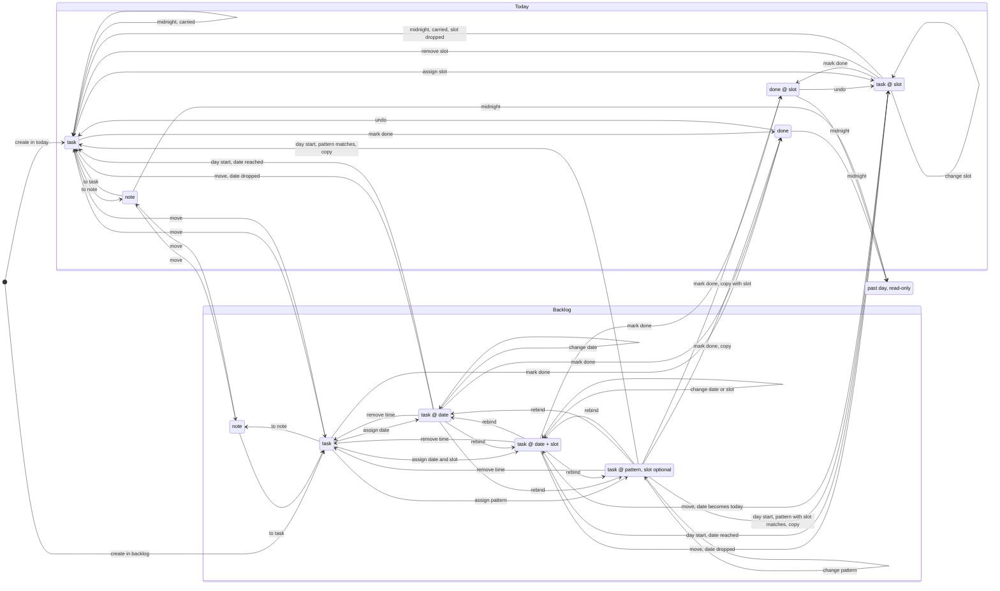

# Diurnus — maszyna stanów pozycji: projekt

**Status:** graf zaakceptowany, maszyna zaimplementowana i podłączona do aplikacji
(schemat v6) · **Data:** 2026-09-25 · **Kod:** [`src/lib/machine.ts`](../../../src/lib/machine.ts),
testy [`test/machine.test.ts`](../../../test/machine.test.ts)

## 1. Cel

Jedna, deterministyczna maszyna stanów dla wszystkiego, co żyje w dwóch polach: **dziś**
i **backlogu**. Każda pozycja jest w dokładnie jednym stanie naraz, każde przejście jest
nazwane, a zdarzenie, którego graf nie przewiduje, kończy się nazwaną odmową zamiast cichej
zmiany albo cichego braku zmiany. Siatka dnia nie ma własnych danych: to rzut dzisiejszych
zadań, które mają slot.

Obecny model trzyma dla rzeczy z godziną dwa rekordy, pozycję i blok, i po każdej zmianie
uzgadnia je osobną funkcją. Z tego podziału biorą się stany bez wyjścia: godzina pozycji
z backlogu ginie w jej dniu, przegapiony plan wisi jako „planowany", odłożenie bloku do
backlogu go duplikuje, a zegar zmienia stan poza historią cofania. Nowa maszyna ma te
problemy usunąć z założenia, nie łatać.

## 2. Decyzje

| Pytanie | Decyzja |
|---|---|
| Język | **TypeScript**: unie z dyskryminatorem i sprawdzenie wyczerpania przypadków |
| Tworzenie | W dziś albo w backlogu, zawsze jako otwarte zadanie |
| Odhaczenie | W dziś; odhaczone w backlogu przenosi się do dziś |
| Cofnięcie odhaczenia | Każde wykonane zadanie może znów stać się otwarte |
| Notatka | W obu polach; notatka może wrócić do zadania; **notatka nigdy nie ma czasu** |
| Czas w dziś | Slot: godzina i kwadrans; **slot trwa zawsze 30 minut** |
| Czas w backlogu | Data, data ze slotem albo wzorzec; wzorzec może mieć slot |
| Zmiana czasu | Każde wiązanie można zdjąć albo zamienić na dowolne inne |
| Ruch bez czasu | Pozycja bez czasu przechodzi swobodnie między polami |
| Dziś ze slotem → backlog | Staje się pozycją z dzisiejszą datą i tym samym slotem |
| Backlog ze slotem → dziś | Staje się dzisiejszym zadaniem z tym samym slotem; data przepada |
| Data nadchodzi | O świcie pozycje z datą dziś lub wcześniejszą przychodzą do dziś, ze slotem |
| Wzorzec pasuje | O świcie **kopia** przychodzi do dziś; wzorzec zostaje w backlogu |
| Wzorzec odhaczony w backlogu | Wykonana kopia w dziś; wzorzec zostaje |
| Otwarta poprzednia kopia | Wzorzec **nie przysyła nowej kopii**, dopóki poprzednia jest otwarta |
| Zajęty slot | Przejście jest **odmawiane** |
| Odmowa przyjścia o świcie | Pozycja zostaje w backlogu z datą i **ponawia o kolejnym świcie** |
| Upływ slotu | Nie zmienia stanu; wykonanie oznacza wyłącznie użytkownik |
| Północ | Otwarte zadania przechodzą do nowego dnia; notatki zostają w swoim dniu |
| Wykonane zadania | Nie ruszają się nigdzie: ani do backlogu, ani o północy |

## 3. Graf

Graf w brzmieniu zaakceptowanym w rozmowie. Każda strzałka ma w testach własny przypadek.

Usunięcie zabiera pozycję z każdego stanu; cofnięcie przywraca poprzednią migawkę, jak dziś.

## 4. Reguły poza grafem

- **Slot** to początek na pełnym kwadransie i zawsze 30 minut. W dziś musi zmieścić się
  w godzinach dnia z ustawień i nie może nachodzić na slot innego dzisiejszego zadania,
  także wykonanego.
- **Odmowa** zostawia stan nietknięty. Maszyna zna sześć powodów: nieznana pozycja,
  powtórzony identyfikator, przejście spoza grafu, zajęty slot, slot poza dniem, zła data.
- **Zegar** wchodzi jednym zdarzeniem: przesunięciem dnia. Dla każdego dnia po kolei
  wykonuje północ, potem świt. Aplikacja zamknięta na tydzień przechodzi siedem północy.
- **Północ przed świtem**: przeniesione zadania tracą sloty, zanim przychodzące je zajmą.

## 5. Rozstrzygnięcia implementacji

Graf nie przesądzał kilku szczegółów. Przyjęte rozstrzygnięcia, do zmiany na życzenie:

1. **Spór o slot o świcie.** Najpierw przychodzą pozycje z datą, potem kopie wzorców: data
   jest mocniejszym zobowiązaniem niż wzorzec. W obrębie grupy decyduje kolejność pozycji.
2. **Pierwsze wystąpienie nowego wzorca** liczy się od jutra, bo dzisiejszy świt już minął.
   Wzorzec pasujący do dziś nie przysyła więc kopii dziś.
3. **Odhaczenie wzorca w backlogu** przesuwa jego następne wystąpienie za odhaczone. Jeśli
   wystąpienie było zaległe, następne liczy się od jutra.
4. **Notatką** staje się tylko otwarte zadanie bez czasu, zgodnie z grafem. Zadanie z czasem
   trzeba najpierw go pozbawić. Wykonane zadanie nie staje się notatką.
5. **Kopie wzorca** dostają identyfikator `wzorzec@data`, więc świt jest deterministyczny
   bez generatora identyfikatorów. Kopia odhaczona z backlogu bierze identyfikator ze
   zdarzenia. Każda kopia pamięta wzorzec, z którego pochodzi.

## 6. Jedna otwarta kopia wzorca

Wzorzec nie przysyła kopii, dopóki poprzednia jest otwarta. Bez tej reguły codzienny wzorzec,
którego kopii się nie odhacza, zostawiałby kopię z każdego dnia, bo otwarte zadania
przechodzą na następny dzień.

- **Otwarta kopia** to niewykonane zadanie w dziś albo odłożone do backlogu. Kopia wykonana,
  usunięta albo zamieniona w notatkę nie wstrzymuje wzorca.
- **Pominięte wystąpienie przepada**: wzorzec przesuwa się na następne. Dzięki temu
  poniedziałkowa kopia odhaczona w środę nie sprowadza nowej w czwartek, tylko w kolejny
  poniedziałek.
- **Zajęty slot to co innego**: wtedy wystąpienie nie przepada, tylko ponawia o kolejnym
  świcie, zgodnie z decyzją z tabeli.

## 7. Podłączenie do aplikacji

Aplikacja działa na maszynie od schematu v6.

- **Jedna droga zmiany stanu.** Każda zmiana stanu pozycji to zdarzenie wysłane przez
  `dispatch()` w `src/state.svelte.ts`. Kilka zdarzeń naraz przechodzi albo w całości, albo
  wcale, i trafia do jednej migawki cofania. Odmowa pokazuje komunikat i nic nie zmienia.
- **Dane poza maszyną.** Tekst, kategoria i kolejność pozycji swobodnych to dane, nie stan;
  zmieniają się wprost, ale z migawką cofania. Kopie wzorca dziedziczą kategorię.
- **Zegar.** Raz na sekundę zegar porównuje dzień maszyny z kalendarzem i wysyła `advance`.
  To samo dzieje się przy starcie, więc stan zapisany tydzień temu dochodzi do dziś dzień po
  dniu. Przesunięcie dnia czyści historię cofania: cofnięcie przez północ nie ma sensu.
- **Siatka** to rzut dzisiejszych zadań ze slotem. Klik w blok przełącza wykonane ↔ otwarte;
  nic nie startuje ani nie kończy się samo, czas zmienia tylko kolor. Wykonanego zadania nie
  da się przeciągnąć na inną godzinę.
- **Ustawienia dnia.** Zwężenie dnia, które wyrzuciłoby dzisiejszy slot poza zakres, jest
  odmawiane z listą godzin, które przeszkadzają.
- **Okienko daty** w ostatniej godzinie dnia nie proponuje :45, bo 30 minut by się nie
  zmieściło. „Bez daty" nie zostawia samej godziny.

### Przejście z v5

`src/lib/migrate.ts`, jednorazowo przy pierwszym wczytaniu starego zapisu albo starej kopii
zapasowej:

- blok z pozycją zlewa się w jedną pozycję ze slotem i kategorią bloku; potwierdzony jest
  wykonany, każdy inny otwarty;
- dzisiejsza pozycja z ukrytą godziną (`at`), której v5 nie pokazywało, dostaje ją jako slot;
- bloki 15-minutowe tracą slot, jeśli 30 minut nachodziłoby na sąsiada albo koniec dnia;
- przeszłość: wykonane i notatki zostają w swoim dniu, otwarte zadania przechodzą do dziś;
  **niepotwierdzone bloki przeszłości przepadają** — v5 też ich nigdy nie przenosiło;
- odrzucone sugestie przepadają; notatka z backlogu traci datę; wykonane z backlogu trafia
  do dziś.

## 8. Testy

- Każda strzałka grafu ma przypadek w tabeli testów.
- Każda odmowa ma przypadek, w tym przeszłość tylko do odczytu.
- Północ i świt: przeniesienie, zostawanie w dniu, przyjścia, spór o slot, ponowienie,
  tydzień nieobecności.
- Własności na losowych ciągach zdarzeń z kilku ziaren: niezmienniki po każdym kroku,
  odmowa nie dotyka stanu, ten sam ciąg daje ten sam stan.
- Żaden stan poza przeszłością nie jest ślepym zaułkiem.
- Typy nie pozwalają zbudować wykonanego zadania w backlogu ani notatki z czasem.
